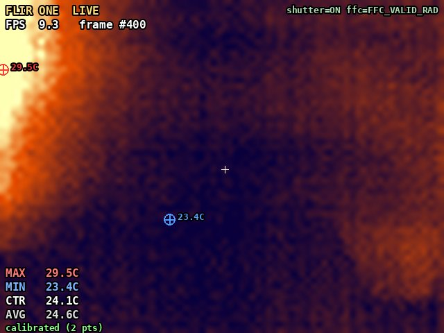
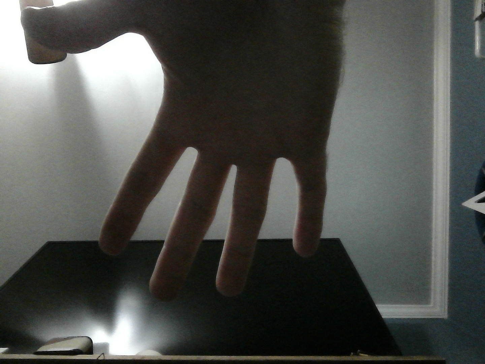

# flir-one-linux

Talk to a **FLIR ONE** thermal camera directly from Linux over raw USB — no Android phone, no official app, no proprietary FLIR SDK.

Includes:
- **`capture.py`** — grab one thermal + visible frame pair to disk (JPEG + PNG + raw `.npy`)
- **`flir_server.py`** — a live local web viewer (MJPEG stream) with on-image overlay (min/max/center/avg temperature, FPS, crosshairs), plus a click-to-calibrate UI



## Hardware this was built against

USB `idVendor=09cb idProduct=1996`, identifies itself as `FLIR Systems` / `FLIR ONE Camera`, `bcdDevice 1.08`. Config value 3, three vendor-specific interfaces, all bulk endpoints — no USB video class, so it won't show up as `/dev/video*` and no kernel driver claims it.

This is a **different hardware/firmware generation** than the older "FLIR ONE G2" (~2015-2016) that most existing public reverse-engineering targets — see "What's new here" below if you're hitting garbled thermal images with the older code.

## Credit

The USB control-transfer handshake that starts the video stream (which `SET_INTERFACE` calls, in which order, on which interfaces) was reverse-engineered by the EEVblog forum community (tomas123, cynfab, and others) and packaged as a v4l2/libusb C driver in [fnoop/flirone-v4l2](https://github.com/fnoop/flirone-v4l2) (GPL-2.0). This project reimplements that handshake in pure Python (`pyusb`) and builds on it — this repo is GPL-3.0 to stay compatible.

## What's new here

The existing G2-era reverse-engineering assumes the thermal payload is a 160x120 image delivered as two interleaved 82-pixel-wide sensor lanes (row stride 164, with a `+4` offset correction for the right half of each row). **That layout does not match this hardware.** On this unit the thermal payload is a plain, non-interleaved **82x62 grid of little-endian uint16 samples, starting 30 bytes into the frame chunk**. Column 0, the last column, and the last 2 rows are telemetry/dark-reference pixels; cropping them leaves the true native **80x60** Lepton sensor image.

This was found empirically: brute-force reshape the raw payload at every plausible `(byte offset, width)` pair, score each candidate by how spatially *smooth* the reshaped image is (a real thermal image varies smoothly; a wrong width/stride produces visual noise), and take the best-scoring candidate. It was then confirmed by imaging a hand and checking the fingers lined up with the simultaneous visible-camera frame. The final layout constants are in `capture.py`'s `parse_thermal()`.

If you're reverse-engineering a *different* FLIR ONE hardware revision and neither layout matches, the brute-force-reshape-and-score approach above is the reusable trick — steal it.

## Protocol summary

- Device exposes 3 USB interfaces, all `bInterfaceClass 0xFF` (vendor-specific):
  - Interface 0: control channel (bulk `0x81` IN / `0x02` OUT)
  - Interface 1: file-transfer channel, "`com.flir.rosebud.fileio`" (bulk `0x83` IN / `0x04` OUT) — **unexplored**, see "Ideas for someone to pick up"
  - Interface 2: frame stream, "`com.flir.rosebud.frame`" (bulk `0x85` IN / `0x06` OUT)
- To start streaming: `libusb_set_configuration(dev, 3)`, claim all 3 interfaces, then send this exact sequence of **standard `SET_INTERFACE` control transfers** (`bmRequestType=0x01, bRequest=0x0B`):
  1. `wValue=0, wIndex=2` (stop interface 2)
  2. `wValue=0, wIndex=1` (stop interface 1)
  3. `wValue=1, wIndex=1` (start interface 1)
  4. `wValue=1, wIndex=2`, with 2 zero data bytes (start interface 2 → frames begin arriving on `0x85`)
- **You must keep polling `0x81` and `0x83` too**, even though the frame data you want is only on `0x85` — leaving them un-read appears to stall the whole vendor protocol.
- Each frame on `0x85` starts with magic bytes `EF BE 00 00`, followed by four little-endian `uint32`s at offsets 8/12/16/20: `FrameSize`, `ThermalSize`, `JpgSize`, `StatusSize`. After the 28-byte header: `ThermalSize` bytes of thermal payload, then `JpgSize` bytes of a normal JPEG (the visible camera image), then `StatusSize` bytes of a JSON status string (shutter state, FFC calibration state, timestamps).
- Frames arrive in chunks up to 64KB over bulk transfers; accumulate until you have the full `FrameSize + 28` bytes.

## Known issues / gotchas

- **The device wedges.** If a client disconnects mid-stream without explicitly sending the "stop interface 2" control transfer first, the device stops responding to *new* control transfers (including `set_configuration` and even string descriptor reads) for any subsequent connection. Recovery: `libusb_reset_device()` — this triggers a full USB re-enumeration (device number changes, ~10-15s), so re-acquire the device handle afterward. If that doesn't recover it, a physical unplug/replug (full power cycle) always does. **Always send the stop-interface-2 control transfer in your cleanup path**, even on error paths — `flir_server.py` and `capture.py` both do this.
- **Periodic FFC (flat-field correction) cycles.** The shutter periodically closes for self-calibration; frames captured during this window contain garbage/noise thermal data. The JSON status string tells you: filter out frames where `shutterState == "FFC"`.
- **Fixed ~9.7 fps.** This appears to be a hardware limit of the Lepton core, not something a client can negotiate faster.
- **udev permissions.** The device node defaults to `root:root 0664`, so a normal user can't open it for read/write. Install `udev/99-flir-one.rules` (see Quickstart).

## Temperature calibration

Converting raw sensor counts to °C requires the Planck-equation constants FLIR calibrates at the factory *per device* — we don't have this unit's real constants. `flir_server.py` ships with generic placeholder constants (borrowed from an unrelated sample image found online) purely as a fallback, and they're **measurably wrong** (observed ~7°C high on human skin).

Instead, `flir_server.py`'s web UI has a **Capture** button (or hit Space): center a known-temperature object under the on-screen crosshair, type in its real temperature, and it fits a live linear model (raw count → °C) from your accumulated points. Works well *between and near* your calibration points; expect drift extrapolating far outside that range, since the true raw→temperature response is non-linear (that's what the Planck equation is modeling in the first place). Two points is a straight-line fit; add a third and switch to a quadratic if you need a wider accurate range (not yet implemented — PRs welcome).

One physical gotcha when picking calibration references: **ordinary glass is opaque to long-wave IR (~8-14μm)**, so pointing this camera at something *through* or *inside* glass reads the glass's outer surface temperature, not the object behind/inside it.

## Ideas for someone to pick up

- **Interface 1 (`com.flir.rosebud.fileio`) is unexplored.** The reference C implementation includes a commented-out routine for reading a `CameraFiles.zip` over this channel — it likely contains this unit's actual factory radiometric calibration data (real Planck constants, gain/offset tables), which would make absolute temperature readings accurate without manual calibration.
- **True optical super-resolution.** The native 80x60 grid is coarse; a sub-pixel shift-and-add reconstruction across several frames (given deliberate small camera movement) could meaningfully increase effective resolution. Not attempted here — see `flir_server.py` for where the raw frame is available if you want to try.
- **MSX-style edge fusion.** We capture a co-registered 1440x1080 visible frame with every thermal frame; blending its high-frequency edges into the upscaled thermal image (as FLIR's own "MSX" feature does) would improve perceived detail for free.

## Quickstart

```bash
# libusb-1.0 is a SYSTEM library, not a pip package -- pyusb just binds to it,
# and fails at runtime (not install time) with a cryptic NoBackendError without it.
sudo apt install libusb-1.0-0        # Debian/Ubuntu
# sudo dnf install libusb1           # Fedora
# sudo pacman -S libusb              # Arch

python3 -m venv venv
./venv/bin/pip install -r requirements.txt

sudo cp udev/99-flir-one.rules /etc/udev/rules.d/
sudo udevadm control --reload-rules && sudo udevadm trigger
# unplug and replug the camera so the new rule takes effect

./venv/bin/python capture.py        # single frame -> visible.jpg, thermal_gray.png, thermal_color.png, thermal_raw.npy
./venv/bin/python flir_server.py    # live view at http://127.0.0.1:8765/
```

## Example output

| Visible | Thermal (uncalibrated, false color) |
|---|---|
|  |  |

## License

GPL-3.0 — see [LICENSE](LICENSE). Chosen for compatibility with [fnoop/flirone-v4l2](https://github.com/fnoop/flirone-v4l2), whose reverse-engineered protocol sequence this project is built on.
